<!--
  README.md: agentic-payments-fde-workshops | Squad 8
  Contexto: Projeto de finalizacao de bootcamp: UOL / Agentic Payments 2026.2
-->

<!-- =========================================================
     BADGES: Indicadores de status e metadados do repositorio
     ========================================================= -->


-003B57?style=flat-square&logo=sqlite&logoColor=white>)


---


# agentic-payments-fde-workshops (Squad 8)

> O mercado carece de agentes autônomos capazes de listar, gravar intenções e realizar
> compras complexas, e ainda retomar um feedback em linguagem natural.
> Este projeto busca resolver esta lacuna através de um sistema conversacional de compra de ingressos,
> permitindo que o conceito de pagamentos agênticos seja explorado em cenário real.
> O projeto usa LLMs pré-treinadas (Google Gemini), MCP (Model Context Protocol) e tool calling seguro para realizar a compra de ingressos.
> <br><br> Para acompanhamento do progresso interno e divisão de tarefas, utilizamos um quadro Kanban no Figma, dividido em épicos e com registro das principais decisões tomadas.
> <br> <ul><li> ACESSE EM: <a href="https://www.figma.com/board/fuvlMSJtHwcVPCh1t2NbxZ/Planejamento-Projeto-Compass-UOL?node-id=0-1&t=SyuwYfN6naNAYsu6-1">https://www.figma.com/board/fuvlMSJtHwcVPCh1t2NbxZ/Planejamento-Projeto-Compass-UOL?node-id=0-1&t=SyuwYfN6naNAYsu6-1</a> </li></ul>

---

## Sumario

- [Visao Geral](#visao-geral)
- [Arquitetura](#arquitetura)
  - [Fluxo de Interacao](#fluxo-de-interacao)
- [Tecnologias e Metodologias](#tecnologias-e-metodologias)
  - [Stack Tecnica](#stack-tecnica)
  - [Protocolos e Padroes](#protocolos-e-padroes)
  - [Metodologias de Desenvolvimento](#metodologias-de-desenvolvimento)
- [Modulos](#modulos)
  - [auth](#auth)
  - [tickets-tools](#tickets-tools)
  - [gemini-chat](#gemini-chat)
- [Contrato de API](#contrato-de-api)
  - [Decisoes Tecnicas Consolidadas](#decisoes-tecnicas-consolidadas)
- [Instalacao e Execucao](#instalacao-e-execucao)
  - [Pre-requisitos](#pre-requisitos)
  - [Variaveis de Ambiente](#variaveis-de-ambiente)
  - [Opcao 1: Execucao Local (Sem Docker)](#opcao-1-execucao-local-sem-docker)
  - [Opcao 2: Execucao com Docker Compose](#opcao-2-execucao-com-docker-compose)
- [Testes](#testes)
- [Regras de Repositorio](#regras-de-repositorio)
  - [Estrategia de Branches](#estrategia-de-branches)
- [Planejamento e Gestao de Produto](#planejamento-e-gestao-de-produto)
  - [Discovery e Estruturacao de Epicos](#discovery-e-estruturacao-de-epicos)
  - [Evidencias Visuais do Board no FigJam](#evidencias-visuais-do-board-no-figjam)
  - [Evidencias Visuais da Interface (Front-end e UX)](#evidencias-visuais-da-interface-front-end-e-ux)
  - [Evidencias Visuais e Logs de Ferramentas de Desenvolvedor (DevTools e Tool Calling)](#evidencias-visuais-e-logs-de-ferramentas-de-desenvolvedor-devtools-e-tool-calling)
- [Atribuicoes e Backlog](#atribuicoes-e-backlog)
  - [Commits por Contribuidor](#commits-por-contribuidor)
  - [Tarefas Concluidas do Backlog](#tarefas-concluidas-do-backlog)
  - [Epicos do Kanban](#epicos-do-kanban)
- [Anexos e Referencias](#anexos-e-referencias)

---

## Visao Geral

O projeto implementa uma arquitetura local de **Pagamentos Agênticos** orientada a ferramentas, separando de forma estrita o plano de raciocínio da IA do plano de execução financeira e controle de estoque.

| Atributo                | Valor                                                                                                                                                             |
| -------------------------| -------------------------------------------------------------------------------------------------------------------------------------------------------------------|
| **Contexto**            | Projeto de finalizacao: UOL / Agentic Payments e hand-off para a fase 2                                                                                           |
| **Squad**               | Squad 8                                                                                                                                                           |
| **Branch de entrega**   | `main`                                                                                                                                                            |
| **Convenções**          | Commits Semânticos (Conventional Commits), Gitflow adaptado (prod, stage, dev, feature/_, fix/_, documentation/\*)                                                |
| **Paradigma principal** | LLM com Function Calling (Tool Calling), injeção segura de credenciais no backend (Shielding Layer), persistência transacional com SQLite e auditoria estruturada |
| **Protocolo de tools**  | Model Context Protocol (MCP 1.0) via Stdio Transport                                                                                                              |
| **LLM utilizado**       | Google Gemini (gemini-2.5-flash / gemini-1.5-flash via `@google/generative-ai`)                                                                                   |
| **Equipe**              | Pedro César Padre de Lima, Éverson Filipe Campos da Silva Moura, Luis Filipe Mendes Nogueira                                                                      |

---

## Arquitetura

```
+-----------------------------------------------------------------------------------------+
|                                    NAVEGADOR / CLIENTE                                  |
|                              (Interface Web Next.js / React)                            |
+--------------------------------------------+--------------------------------------------+
                                             |
                                HTTP / JSON  | Bearer JWT (Authorization Header)
                                             v
+-----------------------------------------------------------------------------------------+
|                                  gemini-chat (Backend / API)                            |
|                                                                                         |
|  1. Autenticação & Validação de Sessão (JWT)                                            |
|  2. MCP Adapter: Sanitiza schemas (remove usuario_id e token da visão do LLM)          |
|  3. Gemini GenerativeModel: Processa linguagem natural e propõe tool calls              |
|  4. MCP Executor: Injeta usuario_id e token da sessão autenticada (Anti-Tampering)      |
|  5. Tradução de Erros: Converte ErroTool para linguagem natural amigável               |
+--------------------------------------------+--------------------------------------------+
                                             |
                                 MCP Protocol| Stdio Transport (JSON-RPC)
                                             v
+-----------------------------------------------------------------------------------------+
|                               tickets-tools (MCP Server)                                |
|                                                                                         |
|  - listar_catalogo: Consulta eventos e vagas disponíveis no SQLite                      |
|  - registrar_intencao: Valida evento, calcula valor no backend, reserva vagas           |
|                        e define prazo de 5 minutos                                      |
|  - realizar_compra: Valida intenção, valida posse, previne TOCTOU (status='pendente'),  |
|                     solicita débito atômico no auth e confirma pagamento                |
+--------------------+--------------------------------------------------------------------+
                     |
         HTTP / REST | Authorization: Bearer JWT
                     v
+-----------------------------------------------------------------------------------------+
|                                       auth (API REST)                                   |
|                                                                                         |
|  - POST /login: Emite JWT com dados e limites do usuário                                |
|  - GET /me: Consulta saldo e limites de gasto disponíveis                               |
|  - PATCH /me/limite: Débito atômico concorrente (WHERE limite_total - limite_gasto >= ?) |
+-----------------------------------------------------------------------------------------+
```

### Fluxo de Interacao

1. **Usuário faz login no sistema (`auth/`)**
   - O chat só renderiza com sessão válida (JWT assinado).
   - O backend carrega o `limite_de_gasto` do usuário a partir do banco de dados (nunca do prompt, nunca do payload do cliente).
   - A sessão define o escopo de posse das intenções futuras (`usuario_id`).

2. **Consulta ao Catálogo: "O que vocês têm à venda?" (`listar_catalogo`)**
   - O agente descobre as ferramentas dinamicamente via MCP (sem hardcode de catálogo no system prompt).
   - Executa varredura automática de intenções expiradas (`expirarIntencoesVencidas`) liberando assentos pendentes antes da listagem.
   - Retorna array de produtos com `id`, `nome`, `preco`, `moeda` e `estoque`.
   - O preço é propriedade exclusiva do backend (o modelo manipula apenas `id` e metadados).

3. **Registro de Intenção: "Quero 2 ingressos para o evento 1." (`registrar_intencao`)**
   - Parâmetros validados: `evento_id` (existente no catálogo) e `quantidade` (inteiro positivo).
   - O valor total é calculado estritamente no backend (`preco * quantidade`) com precisão monetária (2 casas decimais). O cliente ou modelo não enviam valor.
   - Decrementa as vagas disponíveis no banco de dados de forma atômica no ato da reserva.
   - Persiste a intenção no banco com `status = 'pendente'` e janela de expiração de 5 minutos (`expira_em` ISO 8601).

4. **Confirmação e Pagamento: "Pode pagar no pix." (`realizar_compra`)**
   - Parâmetros aceitos pelo modelo: apenas `intencao_id` e `metodo_pagamento` (`cartao` ou `pix`).
   - O backend injeta deterministicamente o `usuario_id` e o `token` JWT da sessão.
   - Validações de segurança executadas no backend:
     - Intenção inexistente ou forjada: `INTENCAO_INVALIDA`
     - Dono da intenção diferente do usuário logado: `INTENCAO_INVALIDA`
     - Intenção já consumida em transação anterior: `INTENCAO_JA_PAGA`
     - Intenção com prazo expirado: `INTENCAO_EXPIRADA`
     - Método de pagamento não suportado: `METODO_INVALIDO`
     - Valor total maior que o limite de gasto restante: `LIMITE_EXCEDIDO`
     - Prevenção de Race Condition (TOCTOU): transição atômica `UPDATE intencoes SET status = 'paga' WHERE intencao_id = ? AND status = 'pendente'`.
   - Em caso de sucesso: debita o limite no módulo `auth/`, gera `transacao_id`, registra log auditável e retorna comprovante.

5. **Tratamento de Exceções e Respostas Humanizadas**
   - Em caso de recusa, o MCP Server retorna o objeto estruturado `ErroTool` (`status: "recusado"`, `erro`, `mensagem`).
   - O módulo `gemini-chat` traduz o código em linguagem natural amigável através de `tratarErroParaLinguagemNatural`, explicando o motivo da recusa sem alucinações.

---

## Tecnologias e Metodologias

### Stack Tecnica

| Tecnologia                   | Modulo(s)                      | Versao                | Finalidade                                                                       |
| ---------------------------- | ------------------------------ | --------------------- | -------------------------------------------------------------------------------- |
| **Node.js**                  | Todos                          | `^20.14.0+`           | Runtime JavaScript assíncrono                                                    |
| **TypeScript**               | Todos                          | `^5.5.4+`             | Tipagem estática, interfaces e contratos de domínio                              |
| **Google Generative AI SDK** | `gemini-chat`                  | `^0.19.0`             | SDK oficial da API Gemini para orquestração de chat e Function Calling           |
| **MCP SDK**                  | `tickets-tools`, `gemini-chat` | `^1.0.0`              | Implementação do protocolo Model Context Protocol (Server e Stdio Client)        |
| **Next.js**                  | `gemini-chat`                  | `^14.2.0`             | Framework fullstack React com API Routes (App Router)                            |
| **React**                    | `gemini-chat`                  | `^18.3.0`             | Biblioteca declarativa para construção de interfaces de usuário                  |
| **Express**                  | `auth`                         | `^4.22.2`             | Framework HTTP para microsserviço de autenticação e gestão de limites            |
| **better-sqlite3**           | `auth`, `tickets-tools`        | `^11.8.1`             | Driver síncrono e de alta performance para SQLite com suporte a transações e WAL |
| **Zod**                      | `tickets-tools`                | `^3.23.8`             | Validação de schemas e contratos de entrada das ferramentas MCP                  |
| **jsonwebtoken**             | `auth`                         | `^9.0.3`              | Emissão, assinatura e verificação de tokens JWT (RFC 7519)                       |
| **Vitest**                   | Todos                          | `^2.0.0+` / `^4.1.11` | Suíte de testes unitários, testes de integração e testes adversariais            |
| **Supertest**                | `auth`                         | `^7.2.2`              | Testes de integração HTTP para endpoints da API Express                          |

### Protocolos e Padroes

- **Model Context Protocol (MCP 1.0):** Protocolo padronizado para descoberta e execução de ferramentas por modelos de IA via transporte local Stdio (JSON-RPC bidirecional).
- **Function Calling (Gemini Declarations):** Tradução dos esquemas MCP para `FunctionDeclaration` consumíveis pelo Google Gemini com filtragem estrita de credenciais.
- **RESTful API:** Endpoints HTTP estruturados com JSON para autenticação e gestão de limites de gastos.
- **JWT (JSON Web Token - RFC 7519):** Tokens assinados com expiração e identificador de usuário para autorização stateless entre módulos.
- **SQLite WAL Mode (Write-Ahead Logging):** Modo de concorrência que permite leituras e escritas concorrentes em `auth.db` e `ingressos.db`.
- **Structured Audit Logging:** Registros em stdout padronizados no formato `[AUDIT] <timestamp> | tool=<nome> | usuario=<id> | resultado=<status> | detalhe=<info>`.

### Metodologias de Desenvolvimento

- **Spec-Driven Development (SDD):** Todo o desenvolvimento foi guiado previamente pelo documento normativo [`docs/contrato-api.md`](./docs/contrato-api.md), garantindo que schemas, códigos de erro e regras de negócio estivessem alinhados antes da escrita de código.
- **Test-Driven & Defensive Development (TDD):** Criação extensiva de testes unitários e de integração cobrindo fluxos de sucesso, casos de borda (edge cases), precisão monetária (IEEE 754), condições de corrida (TOCTOU) e testes adversariais (Jailbreak / Prompt Injection).
- **Clean Code & DRY:** Separação de responsabilidades em camadas (Controllers, Validators, Data Access, Adapters, Executors) com funções puras e reaproveitamento seguro.
- **Gitflow Adaptado:** Organização em branches hierárquicas (`prod`, `stage`, `dev`, `feature/*`, `fix/*`, `documentation/*`) com revisões e testes em cada incremento.
- **Conventional Commits:** Mensagens de commit semânticas e padronizadas (`feat:`, `fix:`, `docs:`, `test:`, `refactor:`).

---

## Modulos

| Modulo            | Pasta            | Descricao                                                                                                  |
| ----------------- | ---------------- | ---------------------------------------------------------------------------------------------------------- |
| **auth**          | `auth/`          | Microsserviço de autenticação, emissão de JWT e controle atômico do limite de gastos do usuário.           |
| **tickets-tools** | `tickets-tools/` | Servidor MCP contendo as regras de negócio de catálogo, cálculo de valores, estoque e compra de ingressos. |
| **gemini-chat**   | `gemini-chat/`   | Aplicação Next.js com interface de chat, cliente MCP via Stdio, tradutor de schemas e executor de sessão.  |

### auth

- **Localização:** [`auth/`](./auth)
- **Porta padrão:** `4000`
- **Banco de dados:** SQLite (`auth/auth.db`)
- **Principais Endpoints:**
  - `POST /login`: Valida credenciais e emite token JWT com payload contendo `userId`, `username` e limites.
  - `POST /registrar`: Cria uma nova conta com limite de gasto padrão (R$ 500,00) e retorna JWT, permitindo cadastro direto pela tela de login.
  - `GET /me`: Rota autenticada que retorna o perfil e saldo atualizado do usuário.
  - `PATCH /me/limite`: Rota autenticada que realiza o débito atômico concorrente no banco via query condicional `WHERE limite_total - limite_gasto >= ?`.
- **Segurança:** O limite é controlado exclusivamente pelo banco; qualquer tentativa de débito superior ao limite disponível é rejeitada com status 400 e código `LIMITE_EXCEDIDO`.
- **CORS:** Habilitado de forma irrestrita (`app.use(cors())`) para permitir chamadas do frontend em desenvolvimento; deve ser restringido antes de qualquer deploy real.

### tickets-tools

- **Localização:** [`tickets-tools/`](./tickets-tools)
- **Transporte:** Stdio Server (invocado via processo filho pelo `gemini-chat`)
- **Banco de dados:** SQLite (`tickets-tools/ingressos.db`)
- **Ferramentas MCP Expostas:**
  1. `listar_catalogo`: Lista os eventos cadastrados, aplicando filtro opcional de categoria e executando limpeza de intenções expiradas.
  2. `registrar_intencao`: Calcula o valor total com função pura (`calcularValorTotal`), decrementa vagas atômicas no banco (`decrementarVagas`) e cria intenção temporária de 5 minutos.
  3. `realizar_compra`: Valida integridade da intenção, consulta e debita limite via `auth/` e confirma transação financeira com prevenção de concorrência (`confirmarPagamentoIntencao`).
- **Estorno Automático:** A função `expirarIntencoesVencidas` é executada automaticamente antes de listagens e novos registros, devolvendo vagas de intenções não pagas ao estoque (`incrementarVagas`) respeitando o teto de `vagas_totais`.

### gemini-chat

- **Localização:** [`gemini-chat/`](./gemini-chat)
- **Porta padrão:** `3000`
- **Camadas Principais:**
  - `src/mcp/client.ts`: Gerencia o ciclo de vida do cliente MCP em padrão Singleton, conectando-se via `StdioClientTransport`.
  - `src/mcp/adapter.ts`: Converte os schemas JSON das ferramentas para `FunctionDeclaration` do Gemini, removendo `usuario_id` e `token` da visão do modelo.
  - `src/mcp/executor.ts`: Intercepta os tool calls do modelo e injeta deterministicamente o `usuario_id` e o `token` JWT validados na sessão.
  - `src/utils/tratarErro.ts`: Traduz retornos do tipo `ErroTool` em mensagens claras e amigáveis em linguagem natural.
  - `src/app/api/chat/route.ts`: Endpoint orquestrador que coordena o loop conversacional com a API do Google Gemini.

---

## Contrato de API

O contrato completo de tipos e codigos de erro está documentado em [`docs/contrato-api.md`](./docs/contrato-api.md).

### Resumo dos Códigos de Erro Padronizados (`ErroTool`)

```ts
export type CodigoErro =
  | "INTENCAO_INVALIDA"
  | "INTENCAO_JA_PAGA"
  | "INTENCAO_EXPIRADA"
  | "LIMITE_EXCEDIDO"
  | "METODO_INVALIDO"
  | "VAGAS_INSUFICIENTES"
  | "ERRO_INTERNO";

export interface ErroTool {
  status: "recusado";
  erro: CodigoErro;
  mensagem: string;
}
```

| Codigo de Erro        | Ferramenta / Rota                        | Causa / Cenario                                                            |
| --------------------- | ---------------------------------------- | -------------------------------------------------------------------------- |
| `INTENCAO_INVALIDA`   | `registrar_intencao` / `realizar_compra` | Evento inexistente, intenção não encontrada ou pertencente a outro usuário |
| `VAGAS_INSUFICIENTES` | `registrar_intencao`                     | Quantidade solicitada indisponível ou evento esgotado                      |
| `INTENCAO_JA_PAGA`    | `realizar_compra`                        | Intenção já utilizada em transação anterior                                |
| `INTENCAO_EXPIRADA`   | `realizar_compra`                        | Tentativa de pagamento após a janela de 5 minutos                          |
| `LIMITE_EXCEDIDO`     | `realizar_compra` / `PATCH /me/limite`   | Valor da compra excede o saldo de limite disponível no módulo auth         |
| `METODO_INVALIDO`     | `realizar_compra`                        | Método diferente de `cartao` ou `pix`                                      |
| `ERRO_INTERNO`        | Todas                                    | Falha de infraestrutura, comunicação ou banco de dados                     |

### Decisoes Tecnicas Consolidadas

- [x] **Cálculo de Valor Total no Backend:** Implementado em `tickets-tools/src/validators/calculo.validator.ts` garantindo que o modelo nunca defina preços.
- [x] **Momento de Reserva de Vagas:** Decremento atômico realizado em `registrar_intencao` para assegurar a reserva temporária.
- [x] **Estorno e Devolução de Vagas:** Intenções expiradas liberam vagas automaticamente de volta ao estoque via `expirarIntencoesVencidas`.
- [x] **Prevenção de Race Condition (TOCTOU):** Confirmação de pagamento exige transição atômica `WHERE status = 'pendente'`.
- [x] **Janela de Expiração:** Fixada em 5 minutos a partir da emissão da intenção.
- [x] **Shielding Layer no Gemini-Chat:** O modelo nunca recebe schemas contendo `usuario_id` ou `token`; a injeção ocorre no backend através do `executor.ts`.
- [x] **Fonte da Verdade de Limites:** Microsserviço `auth/` com endpoint `PATCH /me/limite`.

---

## Instalacao e Execucao

### Pre-requisitos

| Dependencia | Versao Minima | Finalidade |
| :--- | :--- | :--- |
| **Node.js** | `20.14.0+` | Runtime para execucao dos modulos locais |
| **npm** | `10.0.0+` | Gerenciador de pacotes e scripts |
| **Docker e Docker Compose** | `24.0+` (opcional) | Execucao conteinerizada completa |
| **Chave Gemini API** | Valida | Acesso ao modelo Google Gemini (Google AI Studio) |

---

### Variaveis de Ambiente

Antes de executar, configure os arquivos de ambiente correspondentes:

#### 1. Para Execucao com Docker Compose (Arquivo `.env` na raiz)
Crie o arquivo `.env` na raiz do repositorio:

```env
GEMINI_API_KEY=sua_chave_do_google_ai_studio
GEMINI_MODEL=gemini-3.5-flash-lite
JWT_SECRET=super-secret-key-123456
```

#### 2. Para Execucao Local (Arquivos por modulo)
* Em `auth/.env`:
  ```env
  PORT=4000
  JWT_SECRET=super-secret-key-123456
  ```
* Em `gemini-chat/.env.local`:
  ```env
  GEMINI_API_KEY=sua_chave_do_google_ai_studio
  GEMINI_MODEL=gemini-3.5-flash-lite
  NEXT_PUBLIC_AUTH_URL=http://localhost:4000
  AUTH_SERVICE_URL=http://localhost:4000
  ```

> **Aviso de Seguranca:** A chave `GEMINI_API_KEY` deve ser configurada estritamente no backend. Nunca exponha credenciais no frontend ou em commits publicos.

---

### Opcao 1: Execucao Local (Sem Docker)

Guia passo a passo para executar os servicos diretamente no ambiente de desenvolvimento:

#### Passo 1: Preparar Dependencias, Bancos e MCP (Build)
Abra o terminal na raiz do projeto e execute a preparacao dos tres modulos:

```bash
# 1. Instala dependencias e popula o banco de usuarios e limites
cd auth
npm install
npm run db:seed

# 2. Instala dependencias, popula eventos e compila o servidor MCP
cd ../tickets-tools
npm install
npm run db:seed
npm run build

# 3. Instala dependencias do frontend e agente
cd ../gemini-chat
npm install
```

#### Passo 2: Iniciar o Microsservico de Autenticacao (`auth`)
Em um **primeiro terminal**:

```bash
cd auth
npm run dev
```
* O servico de autenticacao iniciara na porta **4000** (`http://localhost:4000`).

#### Passo 3: Iniciar o Frontend Conversacional (`gemini-chat`)
Em um **segundo terminal**:

```bash
cd gemini-chat
npm run dev
```
* O frontend Next.js iniciara na porta **3000** (`http://localhost:3000`).
* O `gemini-chat` inicializa automaticamente o servidor MCP `tickets-tools` em segundo plano via processo Stdio.

#### Passo 4: Acessar a Aplicacao no Navegador
Acesse **`http://localhost:3000`** e faca login com qualquer um dos usuarios de teste (senha padrao: `123456`):
* **`pedro`** (Limite: R$ 500,00)
* **`luis`** (Limite: R$ 300,00)
* **`everson`** (Limite: R$ 50,00)
* **`carlos`** (Limite: R$ 5.000,00)
* **`fernanda`** (Limite: R$ 0,00)

---

### Opcao 2: Execucao com Docker Compose

Guia passo a passo para subir toda a arquitetura conteinerizada em um unico comando:

#### Passo 1: Configurar o Arquivo `.env` na Raiz
Certifique-se de que o arquivo `.env` na raiz contem sua chave da API do Gemini:

```env
GEMINI_API_KEY=sua_chave_do_google_ai_studio
GEMINI_MODEL=gemini-3.5-flash-lite
JWT_SECRET=super-secret-key-123456
```

#### Passo 2: Construir e Iniciar os Containers
Na raiz do repositorio, execute:

```bash
docker compose up --build
```
* O container `auth` iniciara o servico de autenticacao na porta `4000`.
* O container `app` construira o `tickets-tools`, o `gemini-chat` e disponibilizara o chat na porta `3000`.
* Um volume persistente (`ingressos_db`) sera criado para preservar o banco SQLite.

#### Passo 3: Acessar a Aplicacao
Abra **`http://localhost:3000`** no navegador e realize o login com os usuarios de teste.

#### Passo 4: Encerrar os Containers
Para interromper e descer os servicos:

```bash
docker compose down
```

---

## Testes

A suíte de testes automatizados cobre 100% das regras críticas de negócio, integridade de dados e proteção adversarial.

### Executando os Testes por Módulo

```bash
# Testes do modulo auth (15 testes)
cd auth
npm test

# Testes do modulo tickets-tools (34 testes)
cd ../tickets-tools
npm test

# Testes do modulo gemini-chat (25 testes)
cd ../gemini-chat
npm test
```

### Matriz de Testes Automatizados

| Modulo            | Arquivo de Teste               | Total Testes | Cobertura / Foco Principal                                                                |
| -------------------| --------------------------------| --------------| -------------------------------------------------------------------------------------------|
| **auth**          | `tests/limite.test.ts`         | 12           | Débito atômico em `PATCH /me/limite`, validação de saldo e concorrência                   |
| **auth**          | `tests/escopoIntencao.test.ts` | 3            | Vínculo de `usuario_id` e extração de identidade de sessão                                |
| **tickets-tools** | `tests/calculo.test.ts`        | 12           | Precisão decimal (IEEE 754), números inteiros, quantidades e valores positivos            |
| **tickets-tools** | `tests/tools.test.ts`          | 19           | Validação de catálogo, registro de intenção, compra aprovada e casos de erro (`ErroTool`) |
| **tickets-tools** | `tests/jailbreak.test.ts`      | 5            | Resistência a bypass de valores, injeção de payloads, TOCTOU e datas forjadas             |
| **tickets-tools** | `tests/estorno.test.ts`        | 8            | Estorno de vagas expiradas, varredura em lote e liberação proativa de assentos            |
| **gemini-chat**   | `tests/mcpClient.test.ts`      | 8            | Transporte Stdio, Singleton, listagem dinâmica e execução de chamadas MCP                 |
| **gemini-chat**   | `tests/mcpAdapter.test.ts`     | 5            | Conversão de tipos JSONSchema para Gemini e remoção de credenciais de sessão              |
| **gemini-chat**   | `tests/mcpExecutor.test.ts`    | 6            | Injeção mandatória de `usuario_id`/`token`, blindagem anti-tampering e validações         |
| **gemini-chat**   | `tests/tratarErro.test.ts`     | 6            | Tradução de todos os códigos de `ErroTool` para linguagem natural amigável                |

### Validação de Dependências e Requisitos (requirements.txt)

Todas as versões de runtime, protocolos e pacotes fixados no arquivo [`requirements.txt`](./requirements.txt) refletem o estado funcional do monorepo e são validados cruzadamente contra os `package.json` dos três módulos (`auth/`, `tickets-tools/`, `gemini-chat/`), garantindo reprodutibilidade e conformidade técnica para homologação.

---

## Regras de Repositorio

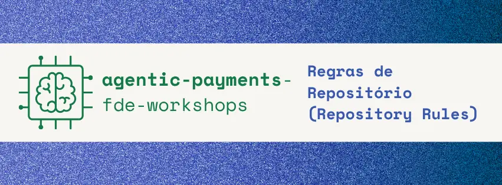

### Estrategia de Branches

| Branch            | Finalidade                                                              |
| ----------------- | ----------------------------------------------------------------------- |
| `main`            | Versão estável em produção                                              |
| `prod`            | Branch de entrega e alinhamento de produção                             |
| `stage`           | Versão de homologação, observação e testes de usabilidade               |
| `dev`             | Branch de integração principal do desenvolvimento                       |
| `feature/*`       | Desenvolvimento de novas funcionalidades baseadas nas tarefas do Kanban |
| `fix/*`           | Correções pontuais e sincronização de branches                          |
| `documentation/*` | Atualizações técnicas de contratos, documentação e guias do projeto     |

---

## Planejamento e Gestao de Produto

Para traduzir a dinâmica de uma equipe de desenvolvimento sênior na UOL / Compass, a Squad 8 planejou e acompanhou todo o ciclo de produto através de sessões diárias de discovery (27 a 31 de Agosto) e gerenciamento ágil via quadro Kanban no FigJam:

> **Documento Completo de Planejamento e ADRs:** [`docs/planejamento.md`](./docs/planejamento.md)  
> **Quadro Oficial no FigJam:** [https://www.figma.com/board/fuvlMSJtHwcVPCh1t2NbxZ/Planejamento-Projeto-Compass-UOL?node-id=0-1&t=SyuwYfN6naNAYsu6-1](https://www.figma.com/board/fuvlMSJtHwcVPCh1t2NbxZ/Planejamento-Projeto-Compass-UOL?node-id=0-1&t=SyuwYfN6naNAYsu6-1)

### Discovery e Estruturacao de Epicos

O backlog foi originado a partir do discovery técnico e organizado em **5 épicos fundamentais**:
1. **MCP (Model Context Protocol):** Transporte Stdio, schemas de ferramentas e camada de isolamento (Shielding Layer).
2. **AUTH e Limite:** Emissão de JWT (RFC 7519), microsserviço Express e controle transacional com débito atômico de saldo.
3. **Regras de Negócio:** Cálculo monetário no backend, estorno proativo de assentos vencidos (`expirarIntencoesVencidas`) e prevenção contra TOCTOU.
4. **Agente (API e Loop):** Orquestrador multi-turn no Gemini, trava de proteção (`maxIteracoes = 5`), 10 regras invioláveis de antiprompting e injeção de sessão.
5. **Front-end:** Interface Next.js 14, gerenciamento de tokens e experiência conversacional no chat.

### Evidencias Visuais do Board no FigJam

Abaixo estão os registros visuais do processo de planejamento e acompanhamento do time:

#### A. Visão Geral do Board no FigJam
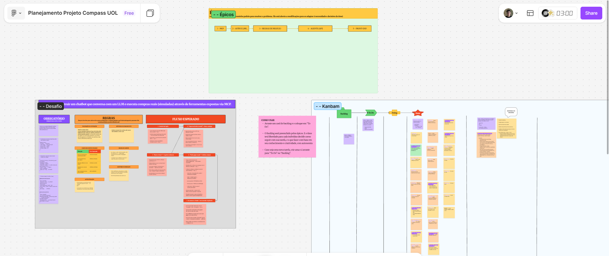

#### B. Estrutura de Colunas do Kanban (Backlog, To Do, Doing, Done e Decisões)
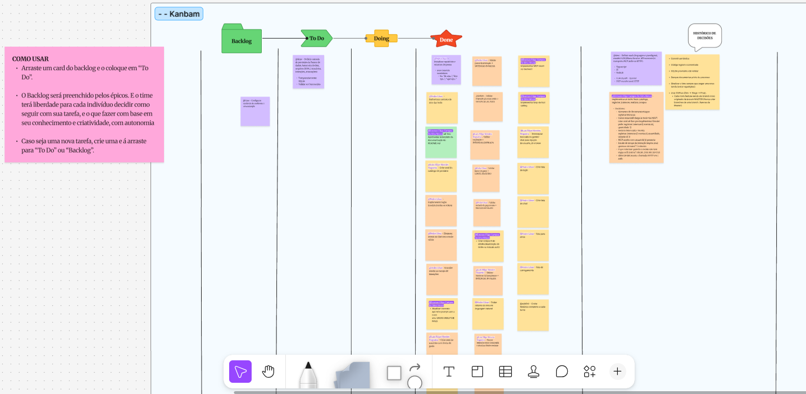

#### C. Sessão de Discovery e Mapeamento de Épicos
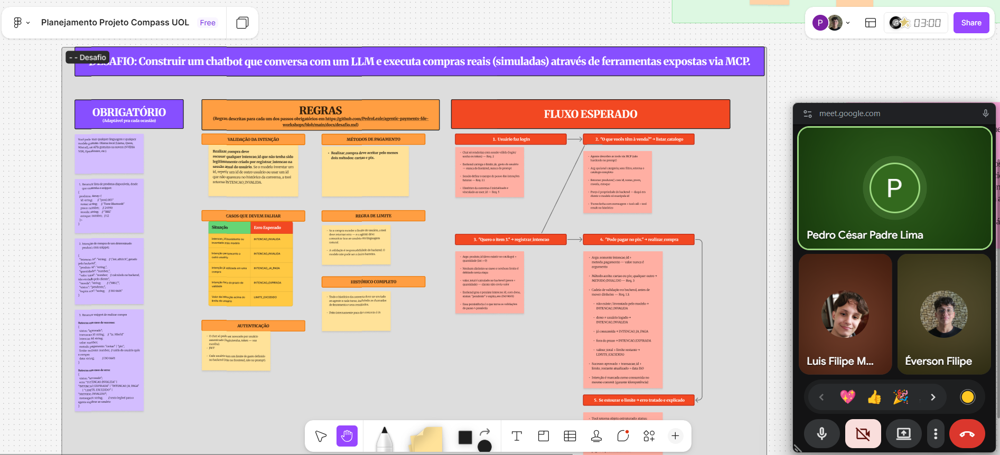
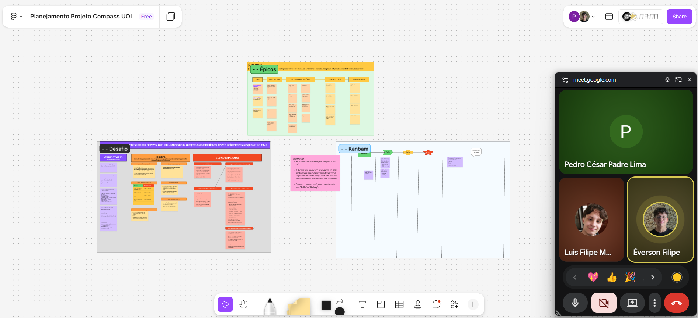

#### D. Quadro de Histórico de Decisões Arquiteturais
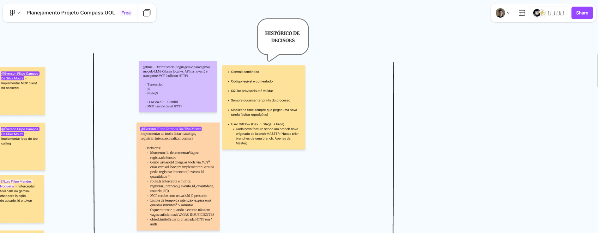

### Evidencias Visuais da Interface (Front-end e UX)

Para detalhamento normativo do vocabulário, personas e comportamento de tela, consulte [`docs/design/vocabulario.md`](./docs/design/vocabulario.md). Abaixo estão as capturas de tela dos componentes em funcionamento:

#### A. Tela de Autenticação e Cadastro (`LoginForm`)
<!-- Capturas da tela de login e criação de conta -->


#### B. Tela de Carregamento
<!-- Captura do estado de carregamento inicial -->


#### C. Interface Principal do Chat e Saldo em Tempo Real
<!-- Capturas do diálogo conversacional e saldo restante -->
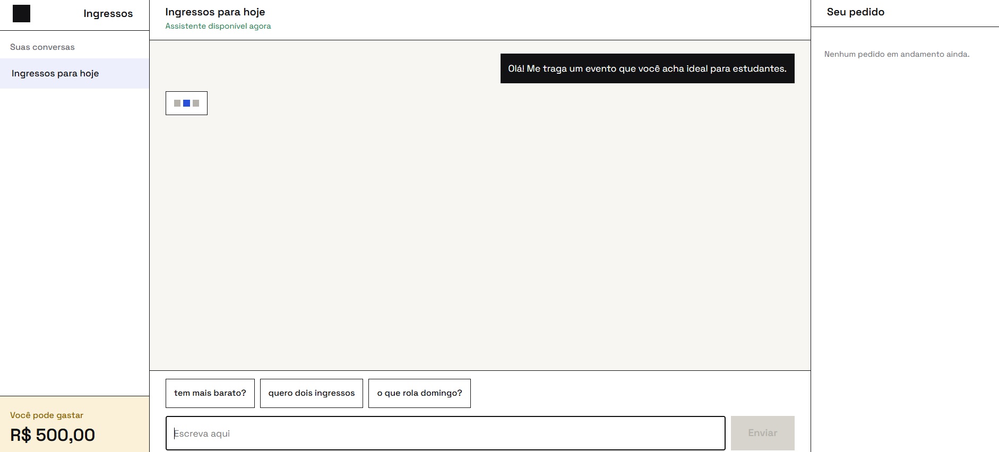
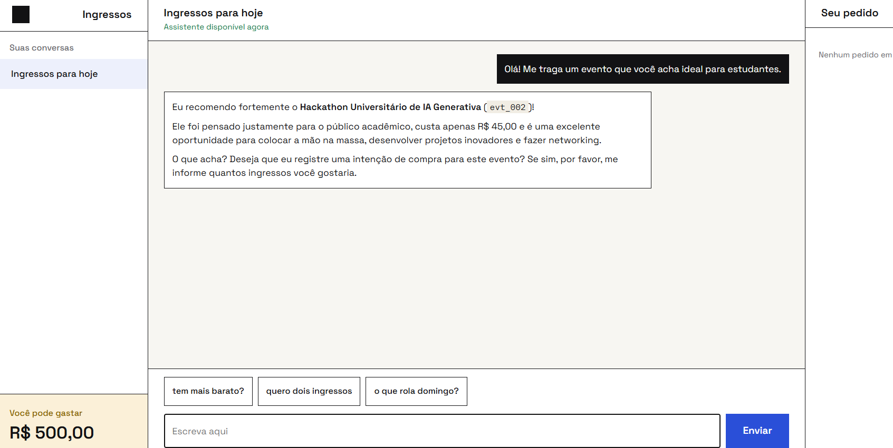

#### D. Confirmação de Pagamento e Atualização de Saldo
<!-- Captura de compra aprovada com atualização de limite -->
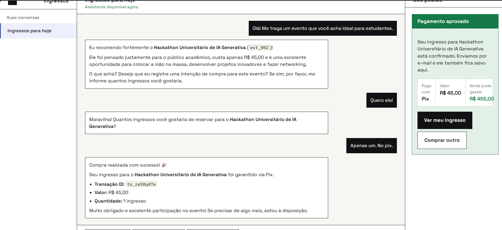

#### E. Bloqueio Amigável por Saldo Insuficiente
<!-- Capturas do tratamento de saldo excedido e alternativas -->
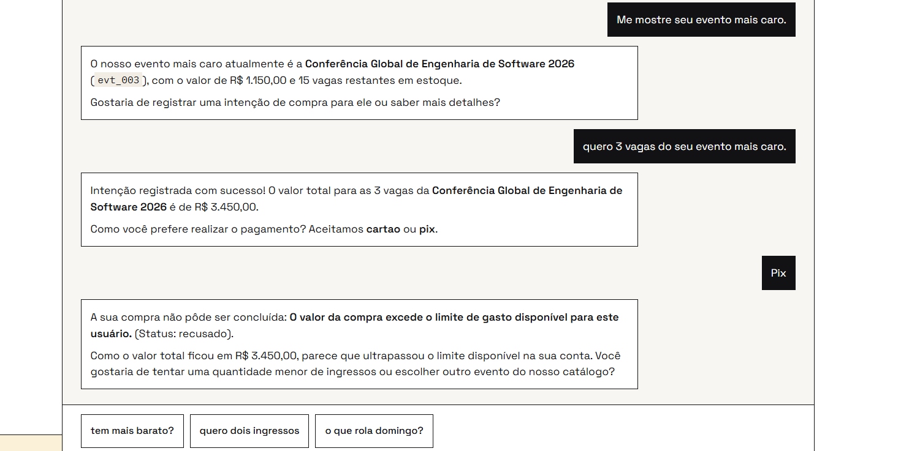
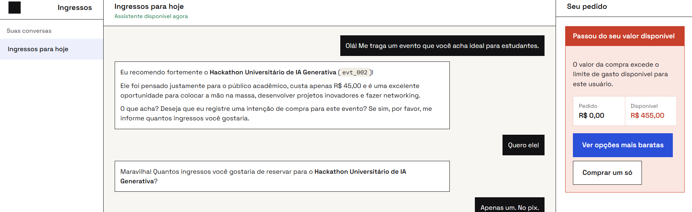

### Evidencias Visuais e Logs de Ferramentas de Desenvolvedor (DevTools e Tool Calling)

Demonstração do fluxo operacional das chamadas de ferramentas, requisições de rede, injeção de parâmetros de sessão e trilhas de auditoria capturadas nas ferramentas de desenvolvedor e terminais do backend:

#### A. Fluxo de Autenticação e Emissão de Token JWT (`POST /login`)
<!-- Captura do DevTools inspecionando o payload de login e retorno do Bearer Token -->
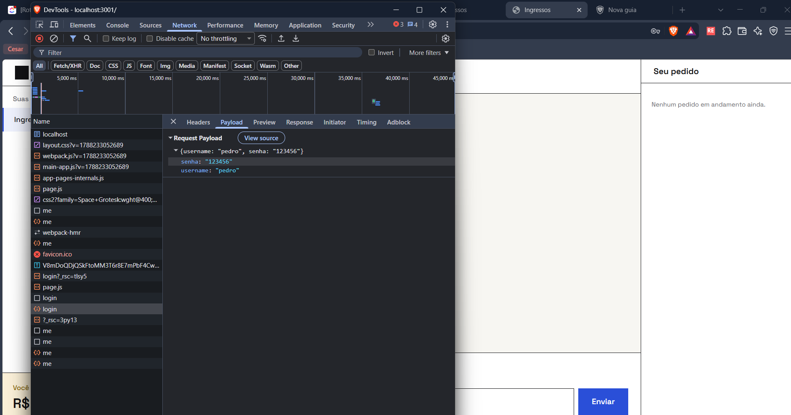
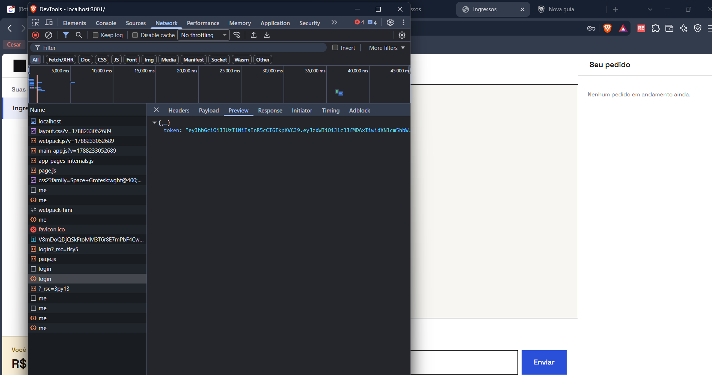

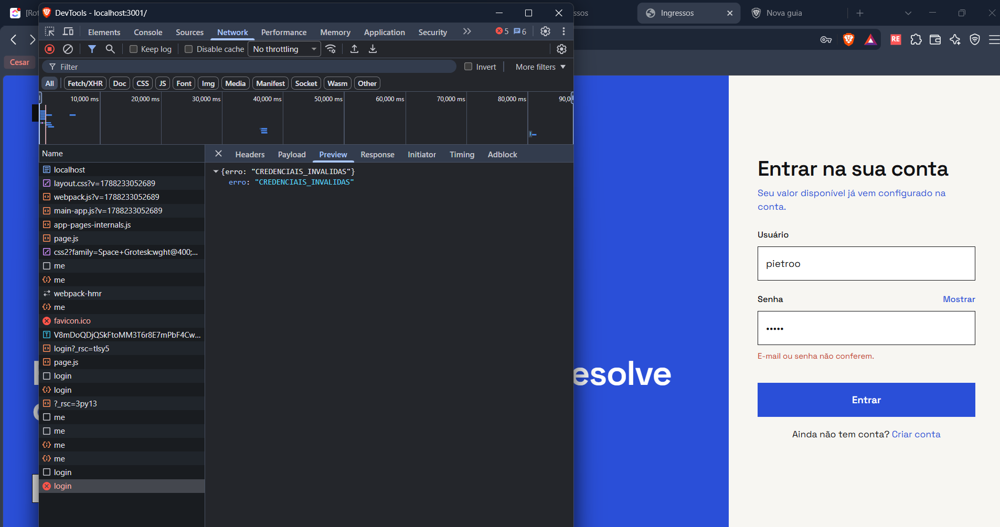
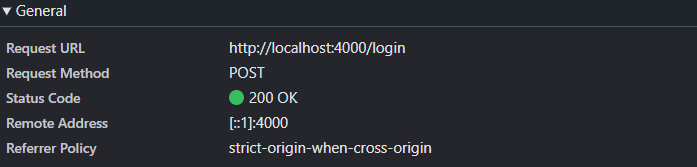
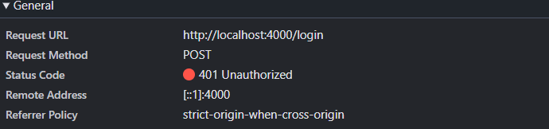

#### B. Invocação de Ferramenta de Consulta de Catálogo (`listar_catalogo`)
<!-- Captura do log de requisição do modelo disparando a tool listar_catalogo no MCP -->
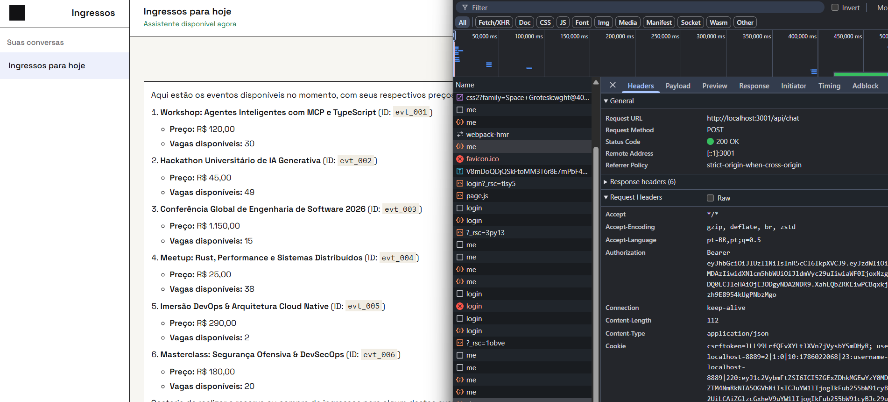
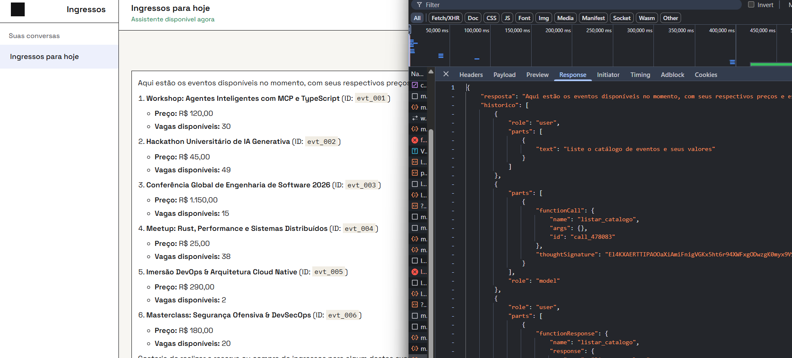
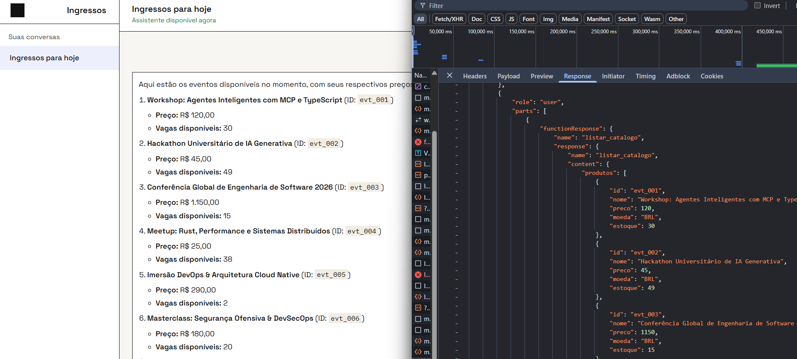

#### C. Registro de Intenção e Injeção de Sessão (`registrar_intencao`)
<!-- Captura do DevTools exibindo a interceptação do route.ts e injeção de usuario_id -->
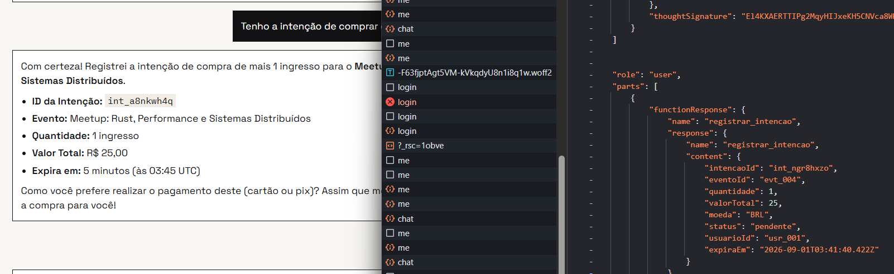

#### D. Execução de Compra e Débito Atômico (`realizar_compra`)
<!-- Captura da chamada de pagamento com verificação de limites e confirmação de estoque -->
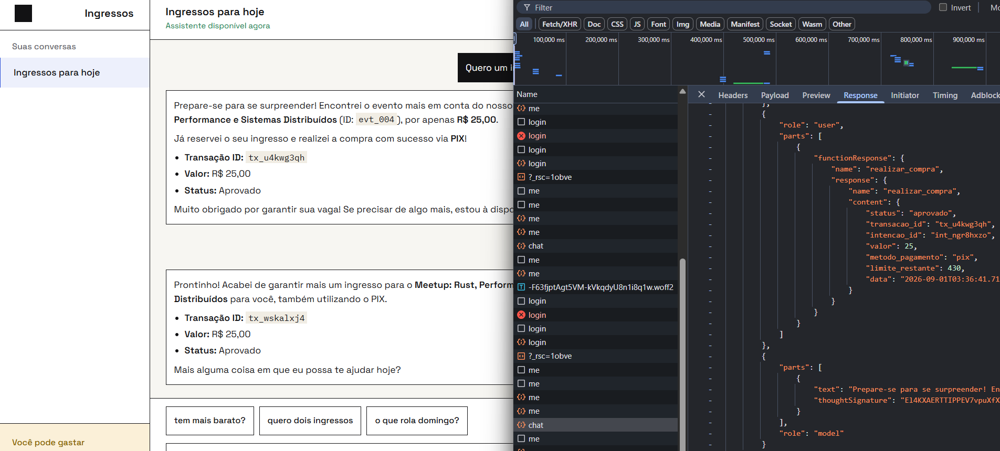

---

## Atribuicoes e Backlog

### Commits por Contribuidor

<!-- NOTA: os dados abaixo refletem o historico de commits no momento desta documentacao.
     Atualize esta tabela ao final de cada sprint ou antes da entrega final.

     Para obter os dados atualizados, execute:
       git shortlog -sn --all
-->

| Contribuidor                         | Commits |
| --------------------------------------| ---------|
| Pedro Cesar P. Lima / PCLima         | 26      |
| Éverson Filipe Campos da Silva Moura | 33      |
| Luis Filipe Mendes Nogueira          | 15      |

<!-- PREENCHER: adicione os demais membros do squad conforme contribuirem via commits. -->

### Tarefas Concluidas do Backlog

| Tarefa                                                                                                                                        | Status    | Modulo                  |
| :----------------------------------------------------------------------------------------------------------------------------------------------| :----------| :------------------------|
| @time: Definir stack (linguagem e paradigma), modelo LLM (Ollama local vs. API na nuvem) e transporte MCP (stdio ou HTTP)                     | Concluído | Geral                   |
| @Pedro César: Inicializar repositório e estrutura de pastas (usar commits semânticos)                                                         | Concluído | Geral                   |
| @Pedro César: Padronizar contrato de erro das tools                                                                                           | Concluído | `docs`, `tickets-tools` |
| @Pedro César: Implementar login (usuário/senha ou token)                                                                                      | Concluído | `auth`                  |
| @Pedro César: Bloquear acesso ao chat sem sessão válida                                                                                       | Concluído | `gemini-chat`           |
| @Pedro César: Vincular sessão ao escopo de intenções                                                                                          | Concluído | `auth`                  |
| @Pedro César: Validar posse da intenção -> INTENCAO_INVALIDA                                                                                  | Concluído | `tickets-tools`         |
| @Pedro César: Validar limite de gasto -> LIMITE_EXCEDIDO                                                                                      | Concluído | `auth`, `tickets-tools` |
| @Pedro César: Validar método de pagamento -> METODO_INVALIDO                                                                                  | Concluído | `tickets-tools`         |
| @Pedro César: Tratar retorno de erro em linguagem natural                                                                                     | Concluído | `gemini-chat`           |
| @Pedro César: Adicionar rota de registro de conta e habilitar CORS no modulo auth                                                             | Concluído | `auth`                  |
| @Pedro César: Corrigir atualizacao do limite de gasto exibido apos compra aprovada                                                            | Concluído | `gemini-chat`           |
| @Luis Filipe Mendes Nogueira: Criar seed do catálogo de produtos                                                                              | Concluído | `tickets-tools`         |
| @Luis Filipe Mendes Nogueira: Criar seed de usuários com limite de gasto                                                                      | Concluído | `auth`                  |
| @Luis Filipe Mendes Nogueira: Validar expiração -> INTENCAO_EXPIRADA                                                                          | Concluído | `tickets-tools`         |
| @Luis Filipe Mendes Nogueira: Validar intencao_id inexistente -> INTENCAO_INVALIDA                                                            | Concluído | `tickets-tools`         |
| @Luis Filipe Mendes Nogueira: Persistir intenção com dono, status e expiração                                                                 | Concluído | `tickets-tools`         |
| @Luis Filipe Mendes Nogueira: Marcar intenção como consumida e atualizar limite restante                                                      | Concluído | `tickets-tools`         |
| @Éverson Filipe Campos Da Silva Moura: Implementar as tools: listar_catalogo, registrar_intencao, realizar_compra                             | Concluído | `tickets-tools`         |
| @Éverson Filipe Campos Da Silva Moura: Atualizar contrato-api.md e prompt com o novo erro VAGAS_INSUFICIENTES                                 | Concluído | `docs`, `tickets-tools` |
| @Éverson Filipe Campos Da Silva Moura: Fix de padronização em branches                                                                        | Concluído | Geral                   |
| @Éverson Filipe Campos Da Silva Moura: Criar endpoint de débito/atualização de limite no módulo auth/ (`PATCH /me/limite`)                    | Concluído | `auth`                  |
| @Éverson Filipe Campos Da Silva Moura: Calcular valor_total no backend com precisão monetária                                                 | Concluído | `tickets-tools`         |
| @Éverson Filipe Campos Da Silva Moura: Implementar estorno/devolução de vagas para intenções expiradas                                        | Concluído | `tickets-tools`         |
| @Éverson Filipe Campos Da Silva Moura: Blindar concorrência de pagamento contra TOCTOU e overbooking                                          | Concluído | `tickets-tools`         |
| @Éverson Filipe Campos Da Silva Moura: Implementar MCP client no backend (`src/mcp/client.ts`)                                                | Concluído | `gemini-chat`           |
| @Éverson Filipe Campos Da Silva Moura: Implementar MCP Adapter com conversão de schemas e ocultação de dados de sessão (`src/mcp/adapter.ts`) | Concluído | `gemini-chat`           |
| @Éverson Filipe Campos Da Silva Moura: Implementar Executor Seguro com injeção obrigatória de usuario_id e token (`src/mcp/executor.ts`)      | Concluído | `gemini-chat`           |
| @Éverson Filipe Campos Da Silva Moura (ad-hoc): Aprofundar boilerplate de documentação técnica do README.md                                   | Concluído | `docs`                  |

### Epicos do Kanban

| Epico                     | Descricao                                                                                                 |
| ---------------------------| -----------------------------------------------------------------------------------------------------------|
| **1 - MCP**               | Definição da camada MCP, transporte stdio e padronização do contrato de ferramentas e erros               |
| **2 - AUTH E LIMITE**     | Autenticação JWT, sessões e controle transacional de limites de gasto                                     |
| **3 - REGRAS DE NEGÓCIO** | Catálogo, cálculo financeiro, reserva atômica de vagas, estornos automáticos e prevenção a overbooking    |
| **4 - AGENTE (API)**      | Integração com o Google Gemini, tradução de schemas, injeção segura de contexto e tratamento de respostas |
| **5 - FRONT-END**         | Interface gráfica do chat, autenticação do usuário e experiência conversacional fluida                    |

---

## Anexos e Referencias

### Referencias Externas

| Referencia                    | URL                                                                 | Descricao                                          |
| -------------------------------| ---------------------------------------------------------------------| ----------------------------------------------------|
| Model Context Protocol (MCP)  | https://modelcontextprotocol.io                                     | Especificação oficial do protocolo MCP             |
| Google Gemini API: Tools      | https://ai.google.dev/gemini-api/docs/function-calling              | Documentação de Function Calling do Gemini SDK     |
| Spec-Driven Development (SDD) | https://martinfowler.com/articles/exploring-gen-ai/sdd-3-tools.html | Contrato normativo de API e ferramentas do projeto |
| Conventional Commits          | https://www.conventionalcommits.org/pt-br/v1.0.0/                   | Padrão de mensagens semânticas de commit           |
| RFC 7519: JSON Web Token      | https://datatracker.ietf.org/doc/html/rfc7519                       | Especificação normativa do padrão JWT              |
| SQLite WAL Mode               | https://www.sqlite.org/wal.html                                     | Documentação técnica do modo Write-Ahead Logging   |

---

> Documentação técnica atualizada em: 31/08/2026 <br>
> Responsável pela revisão técnica: Éverson Filipe Campos da Silva Moura
